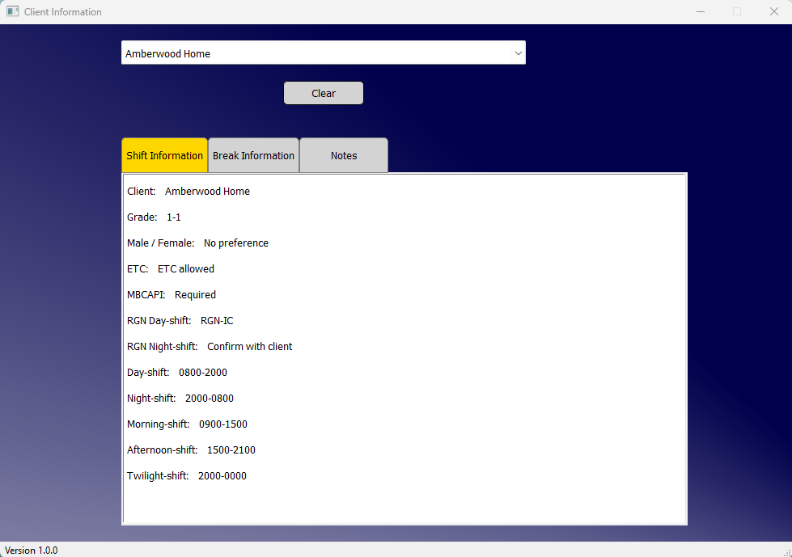
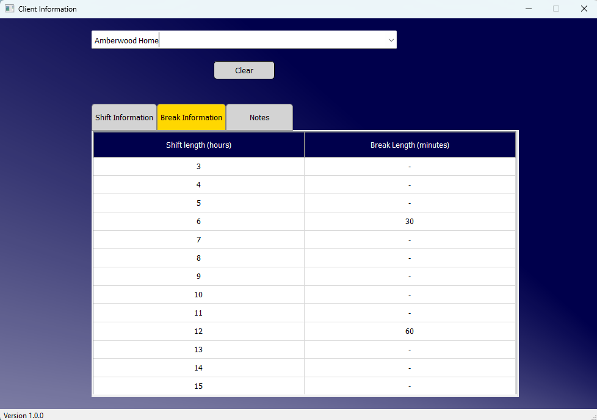
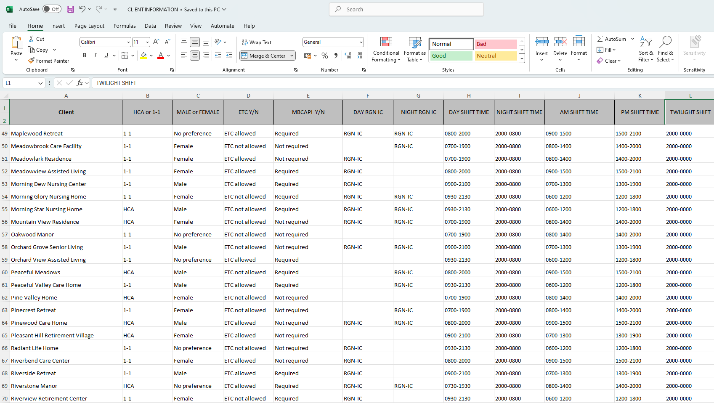

# Excel File to Graphical Interface
**\*\*Important Note**: The spreadsheet used in this project has been populated with fictional data for demonstration purposes only.

Python-based tool that transforms Excel spreadsheet data into an easy-to-read graphical interface. Originally developed as a personal work-related project with permission from my employer in the health care industry, it aims to save time and improve efficiency searching for client information when creating vacant shifts for staff. When I am unfamilar with the client or vague shift details with email request, instead of manually searching through an Excel file, the tool offers a convenient GUI to quickly access relevant information to enable me to create the vacancy with the appropiate gender, shift timings, break times etc.

## Features
- **Autocomplete Search**: Quickly find clients using an autocomplete dropdown.
- **Shift Information Display**: View detailed shift timings, grades, and other relevant information for each client.
- **Break Information**: Displays break lengths based on shift duration for each client.
- **Excel Notes Extraction**: Extracts and displays notes from the "Notes" feature in the Excel file, providing a quick overview of important client information.
- **User-Friendly Interface**: The application is designed to be intuitive, allowing quick access to the data without having to search through Excel files for relevant information.

## Screenshots

Demo video

[Download the demo video](https://github.com/foster-s18/Talk-To-Santa/raw/main/video/demo.mp4)
